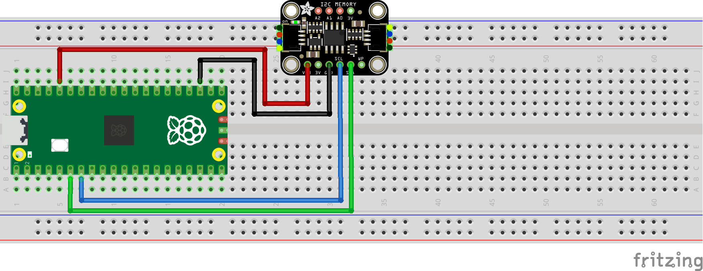

= Reading and writing 24LC32 EEPROM via I2C

This example code demonstrates how to read and write data from 24LC32 EEPROM. It contians a libary with functions for reading data, writing single bytes, and writing pages, and an example which uses these functions.

== Wiring information

[[24lc32_i2c_wiring]]
[pdfwidth=75%]
.Wiring Diagram for 24LC32 EEPROM via I2C.

== List of Files

CMakeLists.txt:: CMake file to incorporate the example into the examples build tree.
24lc32_i2c_lib.c:: Libary containing functions to interact with 24LC32 eeprom via I2C.
24lc32_i2c_lib.h:: Header file containing function declarations for the 24LC32 libary.
example.c:: The example code.

== Bill of Materials

.A list of materials required for the example
[[24lc32_i2c-bom-table]]
[cols=3]
|===
| *Item* | *Quantity* | Details
| Breadboard | 1 | generic part
| Raspberry Pi Pico (any) | 1 | https://www.raspberrypi.com/products/raspberry-pi-pico/
| 24LC32-based breakout board | 1 | https://www.adafruit.com/product/5146
| M/M Jumper wires | 4 | generic part
|===